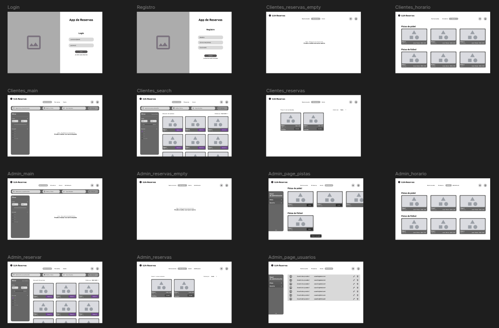

# Proyecto de gestión de reservas de pistas deportivas

## Descripción del proyecto
Este sistema de gestión de reservas está diseñado para facilitar tanto a los usuarios la reserva de pistas
como a los administradores de estas pistas la gestión de los usuarios, las reservas y de las propias pistas
deportivas. El sistema proporciona una interfaz intuitiva y funcionalidades específicas para cada tipo de usuario. 

## Miembros del equipo de desarrollo
* **David Molina Gámez**
* **Pablo José Redondo Silva**
* **Alejandro Rojas García**

## Propuesta preliminar de Historias de Usuario
* Como usuario, quiero crear mi perfil para registrarme en el sistema y acceder a las funcionalidades de reserva. 
* Como usuario, quiero editar mi perfil para mantener actualizada mi información personal. 
* Como usuario, quiero borrar mi perfil para eliminar mi cuenta del sistema si ya no deseo usarla.
* Como usuario, quiero gestionar mis reservas para poder ver, modificar o cancelar mis reservas. 
* Como usuario, quiero consultar mis reservas para verificar las fechas y horarios de mis pistas reservadas. 
* Como usuario, quiero reservar una pista para asegurarme un espacio para jugar. 
* Como usuario, quiero buscar una pista para encontrar la que mejor se adapte a mis necesidades. 
* Como usuario, quiero cancelar una reserva para liberar una pista que ya no necesito. 
* Como administrador, quiero crear pistas para añadir nuevas opciones al sistema. 
* Como administrador, quiero modificar la información de una pista para ajustar detalles como horarios o condiciones. 
* Como administrador, quiero borrar una pista para eliminar aquellas que ya no están disponibles. 
* Como administrador, quiero consultar información de las pistas para tener una visión clara de las opciones disponibles.
* Como administrador, quiero consultar información de los usuarios para tener una visión general sobre el funcionamiento del sistema.

## Diagrama Entidad-Relación

## Storyboard

En el diseño de este storyboard aparecen algunas vistas de usuario duplicadas, con la única excepción del
menú principal, ya que, para los usuarios administradores, también aparece la pestaña **Administración** que
no es visible para cualquier usuario que no sea admin.

De igual modo, se ha intentado reutilizar el máximo de componentes posibles (como las _Cards_ y los menús) con el fin
de facilitar la implementación de dichas vistas.

> Si quieres ver con mejor detalle el storyboard, puedes acceder a la versión de Figma [aquí](https://www.figma.com/design/RypmPI0LgK9UrHO1Pdb57I/UJAReservas?t=nhMEmPFEJYXtYQ29-1).

## Actores principales
En esta implementación hemos propuesto dos tipos de **usuario**:
### 1. Clientes
Pueden gestionar su perfil, consultar y filtrar las pistas disponibles para obtener aquellas pistas
que más se adecúen a sus preferencias y realizar reservas, así como consultar sus reservas realizadas
con la opción de modificarlas e incluso cancelarlas.

### 2. Administradores
Hemos supuesto que un usuario administrador puede reservar pistas al igual que los clientes para, por
ejemplo, realizar eventos de forma que un cliente no pueda hacer uso de dicha pista durante el evento.
Por tanto, los administradores tendrán acceso a las mismas funcionalidades que los clientes y, además,
podrán gestionar las pistas deportivas (creando nuevas, modificando las existentes o eliminando alguna pista)

## Casos de uso
### 1. Gestión de perfil (Usuario)
* **Crear perfil**: Permite a un nuevo usuario registrarse en el sistema
* **Editar perfil**: Permite al usuario modificar su información personal
* **Eliminar perfil**: Permite al usuario eliminar su cuenta

### 2. Gestión de Reservas (Usuario)
* **Reservar pista**: El usuario puede seleccionar y reservar una pista disponible.
* **Buscar pista**: El usuario puede buscar y filtrar pistas para encontrar la pista deseada.
* **Consultar reserva**: Permite ver las reservas realizadas.
* **Cancelar reserva**: El usuario puede cancelar una reserva previa.

### 3. Gestión de Pistas (Administrador)
* **Consultar información de la pista**: Visualización de los detalles y estado de las pistas.

### 3. Gestión de Pistas (Administrador)
* **Crear pista**: Permite al administrador añadir nuevas pistas al sistema.
* **Modificar pista**: Posibilidad de editar la información de una pista existente.
* **Borrar pista**: Elimina una pista del sistema.

 

 

## Relaciones entre casos de Uso
* Los casos de uso _Crear perfil_, _Editar perfil_ y _Borrar perfil_ están incluidos dentro de **_Gestionar perfil_**.
* _**Reservar pista**_ incluye el caso de uso _Buscar pista_.
* _**Gestionar reservas**_ incluye _Consultar reserva_, _Reservar pista_, y _Cancelar reserva_.
* _**Gestionar pistas**_ incluye _Crear pista_, _Modificar pista_, _Borrar pista_ y _Consultar información de la pista_

## Diagrama de clases

## Consideraciones finales
Este sistema está diseñado para ofrecer una experiencia fluida tanto para los clientes que desean
hacer uso de las pistas deportivas como para los administradores que necesitan gestionar la infraestructura
disponible. El uso de relaciones de inclusión entre casos uso asegura la reutilización de funcionalidades
comunes, facilitando el mantenimiento y la extensión del sistema en el futuro.

 

> Nota: Se debe considerar que cuando en este documento se menciona a la entidad _Usuario_ en realidad
> estamos haciendo referencia a la entidad que engloba tanto a _Cliente_ como a _Administrador_. En la
> implementación de este sistema únicamente se realizará el desarrollo de la entidad _Usuario_, con un atributo
> que será el encargado de diferenciar los roles y, por tanto, los permisos de acceso.

> Puedes revisar el Historial de cambios [aquí](./CHANGELOG.md).